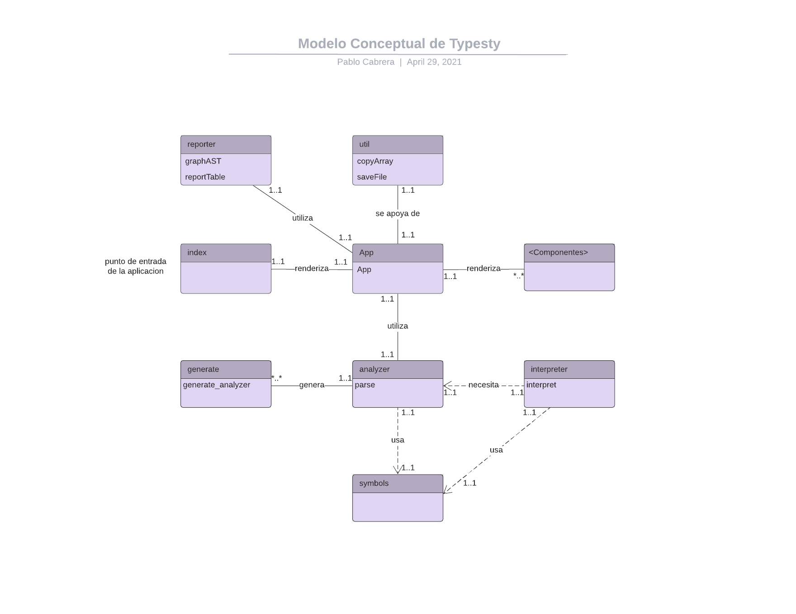

# 1. Manual Técnico

## 1.1. Índice

- [1. Manual Técnico](#1-manual-técnico)
  - [1.1. Índice](#11-índice)
  - [1.2. Glosario](#12-glosario)
  - [1.3. Objetivos](#13-objetivos)
    - [1.3.1. General](#131-general)
    - [1.3.2. Específicos](#132-específicos)
  - [1.4. Alcances del proyecto](#14-alcances-del-proyecto)
  - [1.5. Requerimentos funcionales](#15-requerimentos-funcionales)
  - [1.6. Atributos del sistema](#16-atributos-del-sistema)
  - [1.7. Lenguaje](#17-lenguaje)
    - [1.7.1. Definición del alfabeto](#171-definición-del-alfabeto)
    - [1.7.2. Definición de la sintáxis](#172-definición-de-la-sintáxis)
  - [1.8. Interfaz gráfica (GUI)](#18-interfaz-gráfica-gui)
    - [Creación de Reportes On-Demand](#creación-de-reportes-on-demand)
    - [Implementación de Pestañas](#implementación-de-pestañas)
  - [1.9. Compilación de lenguaje Typesty](#19-compilación-de-lenguaje-typesty)
  - [1.10. Generador de reportes](#110-generador-de-reportes)
  - [1.11. Modelo conceptual](#111-modelo-conceptual)

## 1.2. Glosario
*Referirse al siguiente [enlace](user.md#13-glosario).*

## 1.3. Objetivos
### 1.3.1. General
Poner a disposición del usuario un cliente web con intérprete del lenguaje de programación 'Typesty' incluído.

### 1.3.2. Específicos
- Desarrollo de un compilador completo del lenguaje Typesty
- Esquematización de una interfaz responsive para su uso en distintas plataformas
- Desarrollo de un módulo de señalamiento de errores, para facilitar la programación de lenguaje Typesty.

## 1.4. Alcances del proyecto
Typesty es un proyecto del curso de Organización de Lenguajes y Compiladores 1.
Typesty es un cliente web desarrollado con javascript haciendo uso de las tecnologías React JS y bootstrap. El cliente web es capaz de manejar archivos locales desde su apertura hasta su guardado.

## 1.5. Requerimentos funcionales
- Que la interfaz sea cómoda e intuitiva
- Que el cliente sea estable
- Que el cliente sea rápido en su ejecución
- Que la consola sea de ayuda en la corrección de errores
- Que los reportes generados sean útiles y cómodos de leer
- Que los reportes se puedan exportar

## 1.6. Atributos del sistema
- Responsive
- User Experience
- Establidad
- Facilidad de uso

## 1.7. Lenguaje
La definición del lenguaje se puede consultar en el siguiente [enlace](user.md#1.6.lenguajetypesty).

La definición del lenguaje se divide en dos partes.

### 1.7.1. Definición del alfabeto
El alfabeto de un lenguajes se trata de todos los símbolos que forman parte de este. El alfebeto se puede consultar en el siguiente [enlace](grammar.md#alfabeto).

### 1.7.2. Definición de la sintáxis
La sintáxis de un lenguaje se trata de la definición del correcto orden de los token para dicho lenguaje. La sintáxis del lenguaje se puede consultar en el siguiente [enlace](grammar.md#1.3.sintáxis).

## 1.8. Interfaz gráfica (GUI)
La interfaz de Typesty fue desarrollado totalmente haciendo uso de la tecnología web React JS, conjunto a bootstrap. Los componentes usados se encuentran en la carpeta *components*.

El componente principal es el componente *App*. En el componente App se renderiza una estructura de bootstrap, además de varios componentes propios tales como:

- Logo: logo de Typesty.
- Credits: créditos del cliente.
- Button: botón simple. Utiliza bootstrap y tiene props para su nombre, función, ancho, entre otros.
- Code: editor de código, renderiza un componente CodeMirror (uncontrolled) dentro de una estructura bootstrap.
- Console: renderiza un textarea personalizado que actua como consola, además de manejar la funcionalidad de esta.
- Dropdown: renderiza la lista de pestañas que aparece al presionar el botón 'Pestañas'.

### Creación de Reportes On-Demand
Todos los estados del cliente se encuentran en el componente *App*. Dichos estados almacenan errores, símbolos, los mensajes de la consola, etc.

### Implementación de Pestañas
El código fuente se almacena en un estado *content*. Dicho estado es un objeto que almacena el nombre del archivo y su contenido. El manejo de pestañas se logra con un estado *tabs*. Dicho estado es un array de objetos de código fuente. La lista de objetos se renderiza en el dropdown de tabs y cuando se cambia de pestaña se cambia el estado *content*.

## 1.9. Compilación de lenguaje Typesty
La compilación de lenguaje Typesty se divide en 3 parte principales:

1. Analisis léxico: análisis de todos los tokens que componen un código fuente. El análisis léxico se lleva a cabo con la herramienta Jison, y se puede observar en el archivo *compiler/grammar.jison*.
2. Analisis sintáctico: análisis del orden de los tokens reconocidos por el scanner. El análisis sintáctico se lleva a cabo con la herramienta Jison y se puede observar en el archivo *compiler/grammar.jison*.
3. Analisis semántico: ejecución del árbol de instrucciones reconocido por el parser. El análisis sintáctico se lleva a cabo en el archivo *compiler/interpreter.js*.

La compilación comienza en el scanner, este reconoce todos los tokens del código fuente. Si ocurre un error (símbolos no reconocidos) en este paso no se continua al parser. Luego se valida el orden de esta serie de tokens reconocidos, con el parser. En el parser se crean objetos haciendo uso de funciones del archivo *compiler/symbols.js*. Si ocurre un error (orden de tokens no válido) en este paso no se continua al interpreter. Con el árbol de objetos retornado del parser, se procede a ejecutar siguiendo el flujo del lenguaje Typesty. Se cuenta con varias funciones para ejecutar instrucciones específicas en el archivo *compiler/interpreter.js*. Si ocurre un error (operacion no válida, sentencia exec duplicada, ...) en este paso se termina la ejecución.

Cualquier error durante la compilación se desplegará en la consola de salida, además de ponerse a disposición para el reporte de errores.

## 1.10. Generador de reportes
El cliente web es capaz de generar 3 reportes. Los reportes fueron desarrollados en el archivo *services/reporter.js*.

1. Reporte de errores: tabla con los errores encontrados durante la compilación. Incluye la fila, columna, tipo del error y un mensaje descriptivo del error. Elaborado en html.
2. Reporte de AST: grafo del árbol de instrucciones obtenido del parser, escrito en dot y renderizado con la herramienta HHHH.
3. Reporte de símbolos: tabla con todos los símbolos declarados en la compilación. Incluye la fila, columna, tipo de dato, entorno e identificador con el que se declaró. Elaborado en html.

## 1.11. Modelo conceptual

