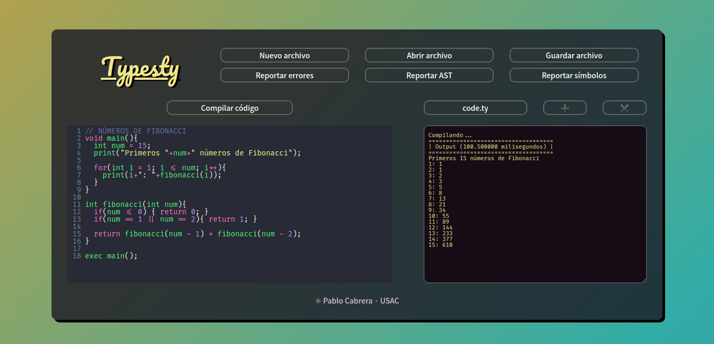

# [Typesty](index.html)

# 1. Manual de Usuario

Guía de uso de Typesty, un compilador web de lenguaje .ty

## 1.1. Índice

- [1. Manual de Usuario](#1-manual-de-usuario)
  - [1.1. Índice](#11-índice)
  - [1.2. Introduccion](#12-introduccion)
  - [1.3. Glosario](#13-glosario)
  - [1.4. Uso de Typesty](#14-uso-de-typesty)
  - [1.5. Interfaz Gráfica](#15-interfaz-gráfica)
    - [1.5.1. Vista principal](#151-vista-principal)
    - [1.5.2. Vista en dispositivos medianos](#152-vista-en-dispositivos-medianos)
    - [1.5.3. Vista en dispositivos pequeños](#153-vista-en-dispositivos-pequeños)
  - [1.6. Lenguaje Typesty](#16-lenguaje-typesty)
    - [1.6.1. Comentarios](#161-comentarios)
    - [1.6.2. Tipos de datos](#162-tipos-de-datos)
    - [1.6.3. Operaciones](#163-operaciones)
      - [1.6.3.1. Operaciones aritméticas](#1631-operaciones-aritméticas)
      - [1.6.3.2. Operaciones relacionales](#1632-operaciones-relacionales)
      - [1.6.3.3. Operaciones lógicas](#1633-operaciones-lógicas)
    - [1.6.4. Otras operaciones](#164-otras-operaciones)
    - [1.6.5. Instrucciones](#165-instrucciones)
      - [1.6.5.1. Declaración de variables](#1651-declaración-de-variables)
      - [1.6.5.2. Asignación de variables](#1652-asignación-de-variables)
      - [1.6.5.3. Incremento y decremento de una variable](#1653-incremento-y-decremento-de-una-variable)
      - [1.6.5.4. Declaración de vectores](#1654-declaración-de-vectores)
      - [1.6.5.5. Modificación de vectores](#1655-modificación-de-vectores)
      - [1.6.5.6. Declaración de listas](#1656-declaración-de-listas)
      - [1.6.5.7. Añadir a listas](#1657-añadir-a-listas)
      - [1.6.5.8. Modificación de listas](#1658-modificación-de-listas)
      - [1.6.5.9. Sentencia if](#1659-sentencia-if)
      - [1.6.5.10. Sentencia else](#16510-sentencia-else)
      - [1.6.5.11. Sentencia switch](#16511-sentencia-switch)
      - [1.6.5.12. Sentencia while](#16512-sentencia-while)
      - [1.6.5.13. Sentencia do-while](#16513-sentencia-do-while)
      - [1.6.5.14. Sentencia for](#16514-sentencia-for)
      - [1.6.5.15. Sentencia break](#16515-sentencia-break)
      - [1.6.5.16. Sentencia continue](#16516-sentencia-continue)
      - [1.6.5.17. Sentencia return](#16517-sentencia-return)
    - [1.6.6. Declaración de funciones y métodos](#166-declaración-de-funciones-y-métodos)
    - [1.6.7. Llamada a funciones o métodos](#167-llamada-a-funciones-o-métodos)
    - [1.6.8. Funciones/métodos nativas de Typesty](#168-funcionesmétodos-nativas-de-typesty)
      - [1.6.8.1. Print](#1681-print)
      - [1.6.8.2. toLower](#1682-tolower)
      - [1.6.8.3. toUpper](#1683-toupper)
      - [1.6.8.4. Length](#1684-length)
      - [1.6.8.5. Truncate](#1685-truncate)
      - [1.6.8.6. Round](#1686-round)
      - [1.6.8.7. Typeof](#1687-typeof)
      - [1.6.8.8. toCharArray](#1688-tochararray)
    - [1.6.9. Sentencia exec](#169-sentencia-exec)
    - [1.6.10. Flujo de la aplicación](#1610-flujo-de-la-aplicación)
    - [1.6.11. Ejemplo de código Typesty](#1611-ejemplo-de-código-typesty)

## 1.2. Introduccion

Typesty se trata de una aplicación web que facilita la escritura, compilación y manejo de archivos del lenguaje propio de la aplicación.

La interfaz de Typesty fue realizada totalmente con React y pretende ser agradable a la vista, además de *responsive*; por otro lado, la compilación de lenguaje Typesty se logró con el analizador léxico y sintáctico Jison.

## 1.3. Glosario

| Término    | Descripción                                                 |
| ---------- | ----------------------------------------------------------- |
| Cliente    | Aplicación que corre en el computador del usuario           |
| React JS   | Tecnología que facilita la creación de interfaces web       |
| AST        | Árbol semántico abstracto                                   |
| Símbolos   | Tabla de símbolos guardados en compilación                  |
| Responsive | Página web adaptable a distintos dispositivos               |
| Compilar   | Proceso de reconocimiento e interpretación de código fuente |
| Scanner    | Analizador léxico de código fuente                          |
| Parser     | Analizador sintáctico de tokens provenientes del scanner    |
| Intérprete | Intérprete del árbol de instrucciones obtenido del parser   |
| Token      | Clasificación de lexema                                     |
| Lexema     | Símbolo del código fuente                                   |
| Tab        | Pestaña en inglés                                           |
| Array      | Arreglo de elementos en inglés                              |

## 1.4. Uso de Typesty

Para ejecutar Typesty en modo desarrollo se provee un comando en el package.json

```sh
npm run dev
```

Este comando iniciará el cliente en un navegador web.

El cliente de Typesty no ha sido deployado, pero puede ser usado de la anterior manera sin inconvenientes.

## 1.5. Interfaz Gráfica

La interfaz de Typesty corre en el navegador, siendo necesario un navegador con javascript activado.

Typesty permite la edición de archivos locales, el manejo de pestañas y generación de reportes varios.

### 1.5.1. Vista principal


1. Manejo de archivos y reportes

   - Nuevo archivo: Genera un archivo en nuevo en la pestaña actual.

   - Abrir archivo: Abre un archivo local .ty y pone su contenido a disposición del editor de código fuente.

   - Guardar archivo: Descarga el contenido de la pestaña actual en un archivo .ty.

   - Reportar errores: Genera un html con los errores encontrados en la compilación de código fuente, y lo muestra en una ventana flotant. Es necesario haber compilado y fallado en el intento para poder generar el reporte de errores.

   - Reportar AST: Genera un grafo con el árbol de sintáxis abstracta (AST) generado en la compilación del código fuente. Es necesario haber compilado exitosamente para poder generar el grafo del AST.

   - Reportar símbolos: Genera un html con los símbolos declarados durante la compilación, y posteriormente lo descarga. Es necesario haber compilado exitosamente para poder generar el reporte de símbolos.

2. Compilar código: botón que llama al compilador con el objetivo final de interpretar el código fuente. La compilación de código Typesty se divide en 3 fases principales:

   - Escaneo de tokens: se clasifican todos los lexemas del código fuente en tokens, por medio de un scanner (jison).
   - Validación de sintáxis: se verifica el correcto orden de tokens obtenido del scanner, haciendo uso de un parser (jison).
   - Interpretación del código: se toma el árbol de instrucciones del parser y se procede a interpretar las instrucción con el flujo del lenguaje de Typesty.

3. Manejo de pestañas

   - Pestañas: Lista de las pestañas actuales. Se puede cambiar a otra pestaña al pulsar en dicha pestaña.
   - Nueva pestaña (➕): Añade una pestaña al final de las pestañas actuales.
   - Cerrar pestaña (✖️): Cierra la pestaña actual.

4. Editor de código fuente: cuadro de código de entrada. En este se visualizan los archivos abiertos. Este editor posee el contenido de la pestaña actual, pudiendo cambiar entre pestañas sin problema. Para facilidad de diseño se hizo uso de la herramienta CodeMirror, específicamente de su componente de React.

5. Consola de salida: consola de Typesty donde se visualizan los output del código fuente, así como los errores y avisos varios.

La interfaz de Typesty es responsiva. Se puede acceder desde cualquier dispositivo cómodamente.

### 1.5.2. Vista en dispositivos medianos


### 1.5.3. Vista en dispositivos pequeños


## 1.6. Lenguaje Typesty

En síntesis el lenguaje que usa Typesty es muy parecido a lenguajes como C++, siendo similar en sus datos, estructuras de control, estructuras cíclicas, entre otras características. Además, el lenguaje Typesty es totalmente case insensitive.

### 1.6.1. Comentarios

Hay dos tipos de comentarios en Typesty.

1. Comentario unilínea: Inician con dos barras diagonales y terminan con la finalización de la línea.

```cpp
// Comentario unilínea
```

2. Comentario multilínea: Inician con una barra diagonal y un asterisco, y finaliza con un asterisco seguido de una barra.

```cpp
/* Comentario
      multilínea */
```

El contenido de los comentarios es ignorado por el compilador.

### 1.6.2. Tipos de datos

Typesty maneja 5 tipos de datos.

1. int: Números enteros, p.e 1, 4, -1, 1920.
2. double: Números con punto flotante, p.e  0.3, 4.359, 1.00001.
3. boolean: Un valor verdadero o falso (true, false).
4. char: Caracter, p.e '0', '\n', 'z'.
5. string: Cadena de caracteres, p.e "hola", "_texto_".

Un string puede contener cualquier texto, mientras que un char únicamente un símbolo ASCII. Adicionalmente, ambos tipos de datos pueden contener secuencias de escape, estas son:

- \n: salto de línea
- \t: tabulación
- \r: regreso de carrete
- \\: barra invertida
- \": comilla doble
- \': comilla simple

### 1.6.3. Operaciones

Los datos se pueden operar de varias formas. A continuación un despliegue de las operaciones soportadas, clasificadas en su naturaleza.

#### 1.6.3.1. Operaciones aritméticas

- Suma: suma de dos valores. Se realiza con el símbolo '+' entre los dos valores.

  Los resultados obtenidos con los distintos tipos de datos son:

  |         |  int   | double | boolean |  char  | string |
  | :-----: | :----: | :----: | :-----: | :----: | :----: |
  |   int   |  int   | double |   int   |  int   | string |
  | double  | double | double | double  | double | string |
  | boolean |  int   | double |   __    |   __   | string |
  |  char   |  int   | double |   __    | string | string |
  | string  | string | string | string  | string | string |

- Resta: resta de dos valores. Se realiza con el símbolo '-' entre los dos valores.

  Los resultados obtenidos con los distintos tipos de datos son:

  |         |  int   | double | boolean |  char  | string |
  | :-----: | :----: | :----: | :-----: | :----: | :----: |
  |   int   |  int   | double |   int   |  int   |   __   |
  | double  | double | double | double  | double |   __   |
  | boolean |  int   | double |   __    |   __   |   __   |
  |  char   |  int   | double |   __    |   __   |   __   |
  | string  |   __   |   __   |   __    |   __   |   __   |


- Multiplicación: multiplicación de dos valores. Se realiza con el símbolo '*' entre los dos valores.

  Los resultados obtenidos con los distintos tipos de datos son:

  |         |  int   | double | boolean |  char  | string |
  | :-----: | :----: | :----: | :-----: | :----: | :----: |
  |   int   |  int   | double |   __    |  int   |   __   |
  | double  | double | double |   __    | double |   __   |
  | boolean |   __   |   __   |   __    |   __   |   __   |
  |  char   |  int   | double |   __    |   __   |   __   |
  | string  |   __   |   __   |   __    |   __   |   __   |

- División: división de dos valores. Se realiza con el símbolo '/' entre los dos valores.

  Los resultados obtenidos con los distintos tipos de datos son:

  |         |  int   | double | boolean |  char  | string |
  | :-----: | :----: | :----: | :-----: | :----: | :----: |
  |   int   | double | double |   __    | double |   __   |
  | double  | double | double |   __    | double |   __   |
  | boolean |   __   |   __   |   __    |   __   |   __   |
  |  char   | double | double |   __    |   __   |   __   |
  | string  |   __   |   __   |   __    |   __   |   __   |

- Potencia: potencia de dos valores. Se realiza con el símbolo '^' entre los dos valores.

  Los resultados obtenidos con los distintos tipos de datos son:

  |         |  int   | double | boolean | char  | string |
  | :-----: | :----: | :----: | :-----: | :---: | :----: |
  |   int   |  int   | double |   __    |  __   |   __   |
  | double  | double | double |   __    |  __   |   __   |
  | boolean |   __   |   __   |   __    |  __   |   __   |
  |  char   |   __   |   __   |   __    |  __   |   __   |
  | string  |   __   |   __   |   __    |  __   |   __   |

- Módulo: módulo de dos valores. Se realiza con el símbolo '%' entre los dos valores.

  Los resultados obtenidos con los distintos tipos de datos son:

  |         |  int   | double | boolean | char  | string |
  | :-----: | :----: | :----: | :-----: | :---: | :----: |
  |   int   | double | double |   __    |  __   |   __   |
  | double  | double | double |   __    |  __   |   __   |
  | boolean |   __   |   __   |   __    |  __   |   __   |
  |  char   |   __   |   __   |   __    |  __   |   __   |
  | string  |   __   |   __   |   __    |  __   |   __   |

- Negación unaria: negación unaria de un valor. Se realiza con el símbolo '-' antes del valor.

  Los resultados obtenidos con los distintos tipos de datos son:

  |         | Resultado |
  | :-----: | :-------: |
  |   int   |    int    |
  | double  |  double   |
  | boolean |    __     |
  |  char   |    __     |
  | string  |    __     |


#### 1.6.3.2. Operaciones relacionales

- Igualación: igualación de dos valores. Se realiza con el símbolo '==' entre los dos valores.
- Diferenciación: diferenciación de dos valores. Se realiza con el símbolo '!=' entre los dos valores.
- Menor: comparación 'menor que' de dos valores. Se realiza con el símbolo '<' entre los dos valores.
- Mayor: comparación 'mayor que' de dos valores. Se realiza con el símbolo '>' entre los dos valores.
- Menor o igual: comparación 'menor o igual que' de dos valores. Se realiza con el símbolo '<=' entre los dos valores.
- Mayor o igual: comparación 'mayor o igual que' de dos valores. Se realiza con el símbolo '>=' entre los dos valores.

Se pueden realizar cualquier operación relacional entre int, double y char, además de entre boolean y boolean.

#### 1.6.3.3. Operaciones lógicas

- OR lógico: de dos valores lógicos. Se realiza con el símbolo '||' entre los dos valores.
- AND lógico: de dos valores lógicos. Se realiza con el símbolo '&&' entre los dos valores.
- NOT lógico: de dos valores lógicos. Se realiza con el símbolo '!' antes del valor.

Se pueden realizar operaciones lógicas únicamente entre valores boolean.

### 1.6.4. Otras operaciones

- Operación ternaria (condicional): operación con tres operandos. Se realiza con una condición (valor boolean), seguido del operador '?', seguido de un valor (cualquiera) resultante en caso la condición sea verdadera, seguida del operando ':', finalizando con el valor (cualquiera) en caso la condición sea falsa.

```cpp
Expresion ? Expresion : Expresion
```

- Casteo: Conversión del tipo de un valor a otro. Se realiza con el nuevo tipo entre paréntesis, seguido del valor a convertir.

```cpp
(TIPO) Expresion
```

- Incremento: incremento de un valor numérico en 1. Se realiza con el símbolo '++'
- Decremento: decremento de un valor numérico en 1. Se realiza con el símbolo '--'
- Llamada a función: llamada a una función. Se realiza con el id de la función seguido de la lista de parámetros entre paréntesis, o nada.

```cpp
ID (Expresion, Expresion, ...)
```

- Acceso a vector: acceso a un elemento de un vector. Se realiza con el id del vector seguido del índice deseado entre corchetes.

```cpp
ID [Expresion]
```

- Acceso a lista: acceso a un elemento de una lista. Se realiza con el id de la lista seguido del índice deseadi entre dobles corchetes.

```cpp
ID [[Expresion]]
```

Cualquier expresion puede ser rodeada entre paréntesis, para priorizar una operación.

```cpp
(Expresion)
```

### 1.6.5. Instrucciones

Las instrucciones (explicadas a continuación) deben ser finalizadas con un ; (punto y coma).

#### 1.6.5.1. Declaración de variables

Para guardar un valor con un identificador primero se debe declarar, asignandole opcionalmente un valor. Los tipos siempre deben coincidir.

Estructura de la instruccion:

```cpp
Tipo id ;
Tipo id = Expresion ;

// Ejemplos:
int x;
string nombre = "Carmena";
```

Si no se especifica un valor se asignará un valor por defecto a la variable. Estos son:

|  Tipo   | Valor por defecto |
| :-----: | :---------------: |
|   int   |         0         |
| double  |        0.0        |
| boolean |       true        |
|  char   |     '\u0000'      |
| string  |        ""         |

#### 1.6.5.2. Asignación de variables

Se puede reasignar el valor a una variable ya declarada. Los tipos siempre debe coincidir.

Estructura de la instruccion:

```cpp
id = Expresion ;

// Ejemplos:
x = 290;
nombre = "Marie";
```

#### 1.6.5.3. Incremento y decremento de una variable

Se incrementa o decrementa en 1 el valor de una variable int o double.

Estructura de la instruccion:

```cpp
id ++ ;
id -- ;

// Ejemplos:
x++;
x--;
```

#### 1.6.5.4. Declaración de vectores

Los vectores son estructuras de datos estáticas. Pueden almacenar varios datos del mismo tipo, y su tamaño se define en su declaración, siendo este invariable luego de la declaración. Se puede definir el tamaño directamente, tomando cada posición el valor por defecto correspondiente, o se pueden definir los valores que tomará el vector.

Estructura de la instruccion:

```cpp
Tipo[] id = new Tipo[Expresion] ;
Tipo[] id = {Expresion, Expresion, ...} ;

// Ejemplos:
int[] numeros = new int[4];
char[] alfabeto = {'a', 'b', ...};
```

#### 1.6.5.5. Modificación de vectores

Para modificar un valor de un vector declarado se debe indicar el índice a modificar, así como el nuevo valor. Los tipos siempre deben coincidir.

Estructura de la instruccion:

```cpp
id[Expresion] = Expresion ;

// Ejemplos:
numeros[0] = 9;
alfabeto[5] = 'E';
```

#### 1.6.5.6. Declaración de listas

Las listas son estructuras de datos dinámicas. Pueden almacenar varios datos del mismo tipo, y su tamaño es 0 en su declaración, pudiendo añadir valores con la instrucción 'Add'.

Estructura de la instruccion:

```cpp
list<Tipo> id = new list<int> ;

// Ejemplos:
list<int> identificaciones = new list<int>;
```

#### 1.6.5.7. Añadir a listas

Para añadir un valor a una lista declarada se debe indicar el nuevo valor; este se añadirá al final de la lista, aumentando su tamaño. Los tipos siempre deben coincidir.

Estructura de la instruccion:

```cpp
id.add(Expresion) ;

// Ejemplos:
identificaciones.add(1001910);
```

#### 1.6.5.8. Modificación de listas

Para modificar un valor de una lista declarada se debe indicar el índice a modificar, así como el nuevo valor. Los tipos siempre deben coincidir.

Estructura de la instruccion:

```cpp
id[[Expresion]] = Expresion ;

// Ejemplos:
identificaciones[[0]] = 9880199;
```

#### 1.6.5.9. Sentencia if

Esta es una sentencia de control que encapsula instrucciones, que serán ejecutadas solo si se cumple una condicion. La condición debe ser un valor boolean.

Estructura de la instruccion:

```cpp
if(Expresion){
  Instrucciones
}

// Ejemplo:
if(true){
  lista.add("hola");
}
```

#### 1.6.5.10. Sentencia else

Sentencia que puede añadirse al final de la sentencia if. Esta encapsula instrucciones a ejecutar solo si la condición es falsa. La condición debe ser un valor boolean.

Estructura de la instruccion:

```cpp
if(Expresion){
  Instrucciones
}
else{
  Instrucciones
}

// Ejemplo:
if(false){
  lista.add("hola");
}
else{
  lista.add("adios");
}
```

#### 1.6.5.11. Sentencia switch

Sentencia de control, contiene una lista de sentencias case y una sentencia default opcional. Cada sentencia case contiene una expresión, que será comparada con la expresión de la sentencia switch; si este es igual se ejecutarán las instrucciones encapsuladas por la sentencia case. La sentencia default será ejecutada si no se ejecuta ninguna sentencia case.

Estructura de la instruccion:

```cpp
switch(Expresion){
  case Expresion:
    Instrucciones
  ...
  default:
    Instrucciones
}

// Ejemplo:
switch("hola"){
  case "hola":
    lista.add("saludo");
  case "adios":
    lista.add("despedida");
  default:
    lista.add("indefinido");
}
```

Si no se ejecuta una sentencia break (explicada más adelante) se siguen ejecutando las instrucciones de las siguientes sentencias case.

#### 1.6.5.12. Sentencia while

Sentencia cíclica. Esta encapsula instrucciones a ejecutar siempre que la condición definida sea verdadera. La condición debe ser un valor boolean.

Estructura de la instruccion:

```cpp
while(Expresion){
  Instrucciones
}

// Ejemplo:
while(isPositive(x)){
  x--;
}
```

#### 1.6.5.13. Sentencia do-while

Sentencia cíclica. Esta encapsula instrucciones a ejecutar siempre que la condición definida sea verdadera. La diferencia con la sentencia while es que las instrucciones encapsuladas se ejecutan al menos una vez. La condición debe ser un valor boolean.

Estructura de la instruccion:

```cpp
do{
  Instrucciones
}while();

// Ejemplo:
do{
  lista.add("capa");
}while(length(lista)<10);
```

#### 1.6.5.14. Sentencia for

Sentencia cíclica. Esta se divide en tres partes: inicialización, condición y actualización. Esta encapsula instrucciones a siempre que la condición definida sea verdadera. La inicialización puede ser una declaración y una asignación dependiendo si la variable ya fue declarada. La actualización puede ser una asignación, un incremento o decremento. La condición debe ser un valor boolean.

Estructura de la instruccion:

```cpp
for(Inicializacion; Expresion; Actualizacion){
  Instrucciones
}

// Ejemplo:
for(int i = 0; i<100; i=i+10){
    char y = (char) i;
    print(y);
}
```

#### 1.6.5.15. Sentencia break

Esta es una sentencia de transferencia. Puede ser usada en un ciclo while, do while, for o una sentencia switch, y sirve para salir de la sentencia.

Estructura de la instruccion:

```cpp
break ;

// Ejemplo:
while(i>0){
  if(i==5){
    break;
  }
}
```

#### 1.6.5.16. Sentencia continue

Sentencia de transferencia. Puede ser usada en un ciclo while, do while o for, y sirve para terminar la ejecución actual, y saltar a la siguiente.

Estructura de la instruccion:

```cpp
continue ;

// Ejemplo:
while(i>0){
  if(i>5 || i<10>){
    continue;
  }
}
```

#### 1.6.5.17. Sentencia return

Sentencia de transferencia usada para retornar un valor dentro de una función.

Estructura de la instruccion:

```cpp
return ;

// Ejemplo:
if(i>0){
  return true;
}else{
  return false;
}
```

### 1.6.6. Declaración de funciones y métodos

La declaración de una función o método requiere el identificador, el tipo (void si es un método), la lista de parámetros de entrada y el cuerpo de instrucciones.

La diferencia entre una función o método radica en el tipo de su valor de retorno. Para una función se puede declarar cualquier tipo de retorno, excepto vacío (void), mientras que para un método el retorno siempre es vacío. Una función siempre deberá retornar un valor del tipo de dicha función.

Estructura de la instruccion:

```cpp
//Declaracion de funcion

int sumar(int num1, int num2){
  int suma = num1+num2;
  return suma;
}

// Declaracion de método

void append(int num){
  lista.add(num)
}
```

### 1.6.7. Llamada a funciones o métodos

La llamada a una función o método es exactamente igual, por la misma razón no se puede usar el mismo identificador para declarar una función y un método.

Estructura de la instruccion:

```cpp
id(Expresion, Expresion, ...) ;

// Ejemplos:
init(true);
boolean valid = isValid();
```

### 1.6.8. Funciones/métodos nativas de Typesty

Typesty cuenta con funciones propias que facilitan ciertas tareas. Dichas funciones son:

#### 1.6.8.1. Print

Este método permite imprimir en la consola de salida cualquier expresión del código fuente. Puede recibir 'n' parámetros.

```cpp
// Ejemplo:
int x = 2;
print("El valor de x es:", x);
print("====================")
```

#### 1.6.8.2. toLower

Esta función permite convertir un valor string hacia minúsculas. Recibe un paŕametro string.

```cpp
// Ejemplo:
string saludo = "BIENVENIDOS";
string saludo_lower = tolower(saludo);
```

#### 1.6.8.3. toUpper

Esta función permite convertir un valor string hacia mayúsculas. Recibe un paŕametro string.

```cpp
// Ejemplo:
string cita = "'El tiempo es relativo'";
string saludo_lower ="Albert Einstein:"+ toupper(cita);
```

#### 1.6.8.4. Length

Esta función retorna la longitud de una cadena, vector o lista. Se le debe pasar un parámetro string, vector o lista.

```cpp
// Ejemplo:
int[] respuestas = {501, 501, 501, 404, 403};
print("Se recibieron " + length(respuestas)+" respuestas");
```

#### 1.6.8.5. Truncate

Con esta función se puede convertir un double en int, al truncar los decimales. Recibe un parámetro double.

```cpp
// Ejemplo:
double height = getHeight();
print("La altura es aproximadamente:", height);
```

#### 1.6.8.6. Round

Esta función redondea un número de punto flotante a su entero más cercano. Recibe un parámetro double.

```cpp
// Ejemplo:
double num = getRandom();
boolean open = round(num) == 1;

if(open){
  print("opening");
}
```

#### 1.6.8.7. Typeof

Esta función permite conocer el tipo de una expresion, pues retorna un valor string con el nombre del tipo de esta. Se le pasa cualquier expresion.

```cpp
// Ejemplo:
if(typeof(x)==='double'){
  print('El valor es double, no se puede asignar')
} else{
  y = x;
}
...
```

#### 1.6.8.8. toCharArray

Esta función permite transformar un string en una lista de caracteres, para asignarlo a un identificador de tipo lista.

```cpp
// Ejemplo:
string name = "Charlie";
list<char> name_list = tochararray(name);
print(name, name_list);
```

### 1.6.9. Sentencia exec

La sentencia exec indica el punto de entrada al código, por medio de una llamada.

Estructura de la instruccion:

```cpp
exec id(Expresion, Expresion, ...) ;

// Ejemplos:
exec main();

void main(){
  ...
}

```

### 1.6.10. Flujo de la aplicación

Al intérpretar el código se realizan los siguientes pasos:

1. Declaración de funciones y métodos del código fuente
2. Ejecución de las instrucciones en el entorno global (fuera de las funciones)
3. Ejecución de la sentencia exec

### 1.6.11. Ejemplo de código Typesty

Código de generación de números fibonacci:

```cpp
// NÚMEROS DE FIBONACCI
void main(){
  int num = 15;
  print("Primeros "+num+" números de Fibonacci");

  for(int i = 1; i <= num; i++){
	print(i+": "+fibonacci(i));
  }
}

int fibonacci(int num){
  if(num <= 0) { return 0; }
  if(num == 1 || num == 2){ return 1; }
  
  return fibonacci(num - 1) + fibonacci(num - 2);  
}

exec main();
```

Salida en la aplicación:


